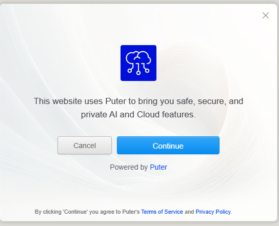

+++
title = 'Dinosauroscopes'
date = 2025-07-14T23:51:31-05:00
draft = false
summary = 'Find out what dinosaur you are, and get your daily dinosauroscope'
tags = ['web design', 'goofs', 'portfolio']
categories = ['goofs']

tech = ["Javascript", "Puter.js", "AI"]
github = "https://github.com/mattkissel/dinosauroscopes"
links = [
    {label = "Live Site",    url = "https://mattkissel.github.io/dinosauroscopes/"},
]
+++

I recently made a [site](https://mattkissel.github.io/dinosauroscopes/) that generates a daily [Dinosauroscopes](https://mattkissel.github.io/dinosauroscopes/) using Puter.js. It makes a query once a day (for that visitor) and retrieves a dinosaur based horoscope. In order to get your daily dinosauroscope you need to accept the pop-up message from Puter. 

If you don't want to give it permission to run the query or hate the use of AI, feel free to click cancel and enjoy the Quiz and "Dive into a Dino" features. 

[https://mattkissel.github.io/dinosauroscopes/](https://mattkissel.github.io/dinosauroscopes/)